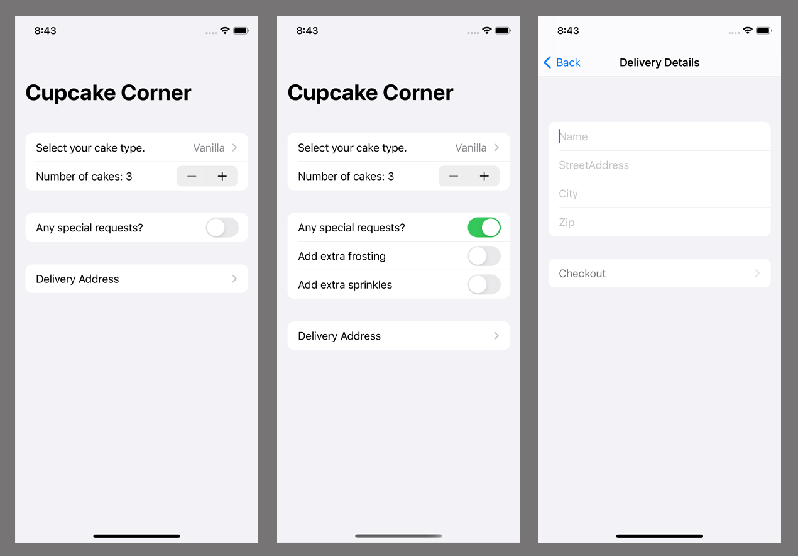

# CupcakeCorner

### Project 10 (HWS)
* Adding Codable conformance for @Published properties
* Sending and receiving Codable data with URLSession and SwiftUI
* Validating and disabling forms
* Taking basic order details
* Checking for a valid address
* Preparing for checkout
* Encoding an ObservableObject class
* Sending and receiving orders over the internet

